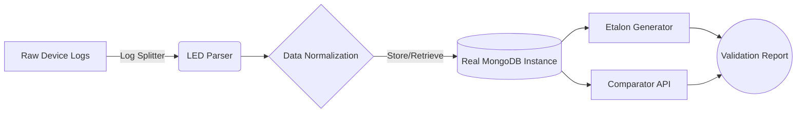

# 🚥 LED Testing Toolkit


The **LED Testing Toolkit** is a highly capable and extensible test framework for simulating, validating, and managing complex LED indication patterns in embedded firmware or hardware devices.

Whether your devices emit simple blinks, complex pulsing signals, or intricate multi-color dynamic sequences, this toolkit empowers you to mathematically model, compare, and validate output logs with rigorous precision.

---

## 📑 Table of Contents
1. [Overview and Architecture](#overview-and-architecture)
2. [Key Features](#key-features)
3. [Prerequisites](#prerequisites)
4. [Setup and Installation](#setup-and-installation)
5. [Configuration](#configuration)
6. [Usage Guide](#usage-guide)
    - [Running the API](#running-the-api)
    - [Using the Command Line Scripts](#using-the-command-line-scripts)
7. [Development and Contribution](#development-and-contribution)
8. [Project Structure](#project-structure)

---

## 🏗 Overview and Architecture

The toolkit bridges the gap between hardware execution and automated software testing. It reads log lines, interpolates dynamic events, aggregates measurements, and mathematically compares them against reference **"Etalon"** (golden standard) states.



> [!IMPORTANT]
> **Database Requirement:** This project relies heavily on persisting large datasets of time-series LED operations and executing complex queries. **A real, running MongoDB instance is strictly required.** The system will not function with an in-memory mock or without valid DB credentials.

---

## ✨ Key Features

- **Robust Parsers**: Extracts high-resolution timestamps, RGB hex codes, and state changes from messy device logs.
- **Mathematical Interpolation & Aggregation**: Smooths out jittery hardware logs, normalizing the timeframe and accounting for hardware latency.
- **Etalon Generation**: Automatically define perfect baseline standards ("etalons") from known good logs.
- **FastAPI Integration**: Offers a comprehensive REST + WebSocket API to upload logs, query devices, and live-stream LED playback patterns to front-end clients.
- **CLI Scripts**: Exposes powerful standalone tools for batch processing large folders of logs efficiently.

---

## ⚙️ Prerequisites

Before you begin, ensure you have the following installed:
- **Python >= 3.13**
- **MongoDB Server >= 5.0** (Running locally, in Docker, or Atlas)
- **uv** (Recommended) or standard `pip` for dependency management.

---

## 🚀 Setup and Installation

### 1. Clone the repository
```bash
git clone <your-repo-url>
cd led-testing-toolkit
```

### 2. Install Dependencies
We recommend using [uv](https://github.com/astral-sh/uv) for lightning-fast dependency resolution.

```bash
# Using uv
uv sync

# Using pip
python -m venv .venv
source .venv/bin/activate
pip install -e .[dev]
```

---

## 🔧 Configuration

The application requires environment variables to connect to the database and bind the API server. 

Copy the provided example file to create your local environment configuration:
```bash
cp .env_example .env
```

Edit the `.env` file to match your infrastructure. For a standard local MongoDB setup without auth, it might look like:

```env
MONGO_DB_HOST=127.0.0.1
MONGO_DB_PORT=27017
MONGO_DB_USERNAME=root
MONGO_DB_PASSWORD=secret
MONGO_DB_NAME=led_metrics_db

API_HOST=0.0.0.0
API_PORT=8080
```

> [!WARNING]
> Do not commit your `.env` file. It is already included in `.gitignore` to prevent credential leaks.

---

## 📖 Usage Guide

### Running the API

Start the FastAPI application via Uvicorn. This serves the primary logic backbone.

```bash
uv run uvicorn api.main:app --host 0.0.0.0 --port 8080 --reload
```
Once running:
- **Swagger Docs**: Visit `http://localhost:8080/docs` to interact with the API endpoints directly.
- **ReDoc**: Visit `http://localhost:8080/redoc` for an alternative, reading-friendly documentation view.

#### Example API Request
*Compare a log pattern against an etalon reference via cURL:*
```bash
curl -X 'POST' \
  'http://localhost:8080/tools/compare_log_pattern' \
  -H 'accept: application/json' \
  -H 'Content-Type: application/json' \
  -d '{
  "pattern_index": 1,
  "etalon_device": "device_v1",
  "etalon_pattern": "boot_sequence"
}'
```

### Using the Command Line Scripts

The toolkit provides several utility scripts located in `led_testing_toolkit.scripts` for direct data manipulation without needing the HTTP server.

**Example: Generating Etalons from source parameters**
```bash
uv run python -m led_testing_toolkit.scripts.generate_etalons --device my_device --pattern boot_blink
```

**Example: Splitting large aggregated log files**
```bash
uv run python -m led_testing_toolkit.scripts.run_logs_splitter --input /path/to/logs --output /path/to/chunks
```

Use the `--help` flag on any script to see detailed parameter requirements.

---

## 💻 Development and Contribution

We maintain a strict code quality standard. The project currently boasts **100% pytest test coverage** and is fully annotated with Google-style docstrings.

### Running Tests
Execute the full test suite (including coverage reporting):
```bash
uv run pytest -c tests/pytest.ini
```
> [!TIP]
> Since the codebase is heavily async, `pytest-anyio` is configured in `tests/conftest.py` to handle the event loops cleanly.

### Code Linting & Formatting
The project uses `ruff` to enforce styling, specifically adhering to a 120-character line length.

Format your code before committing:
```bash
uv run ruff format . --line-length=120
```

Verify there are no linting violations:
```bash
uv run ruff check .
```

---

## 📂 Project Structure

A quick overview of where to find things:

```text
led-testing-toolkit/
├── api/                             # FastAPI application
│   ├── core/                        # Server configuration
│   ├── endpoints/                   # REST and WebSocket routers
│   ├── models/                      # Pydantic schema definitions
│   └── services/                    # Business logic bridging API and toolkit
├── led_testing_toolkit/             # Core Toolkit Logic
│   ├── led_modeler/                 # Sequence generators & simulation logic
│   ├── math/                        # Signal interpolation, aggregation & comparison
│   ├── scripts/                     # CLI entry points for batch tasks
│   ├── utils/                       # File handling and splitting logic
│   ├── led_parser.py                # Regex extraction for log processing
│   ├── led_simulation_runner.py     # Base execution orchestrator
│   └── mongo_db_connector.py        # Async Motor/PyMongo integration
├── tests/                           # 100% coverage pytest suite
├── .env_example                     # Template for environment configuration
└── pyproject.toml                   # Project metadata and dependencies
```
